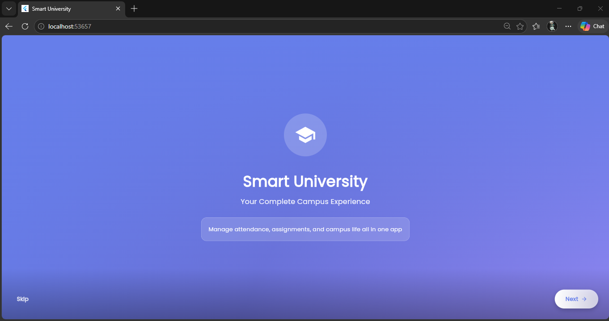
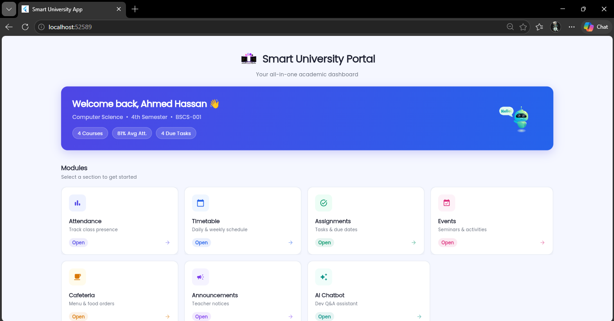
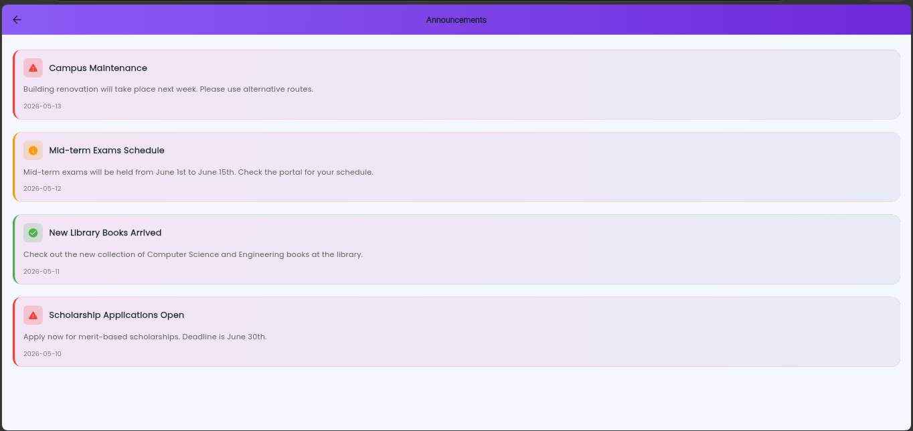
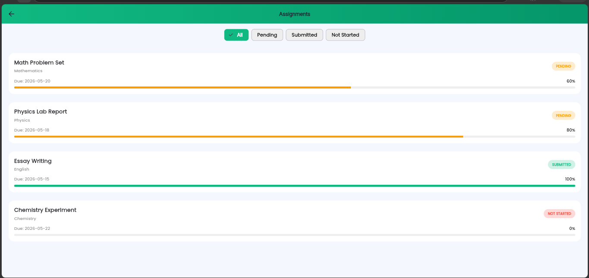
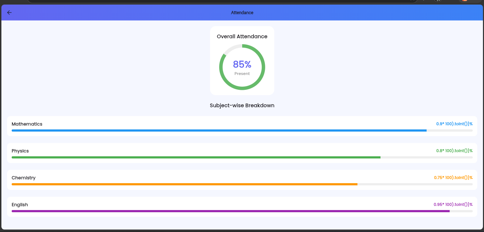
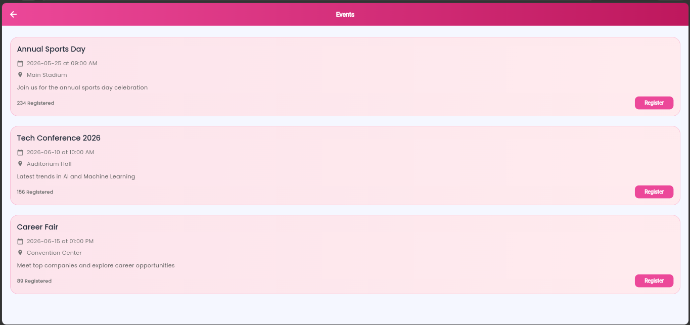
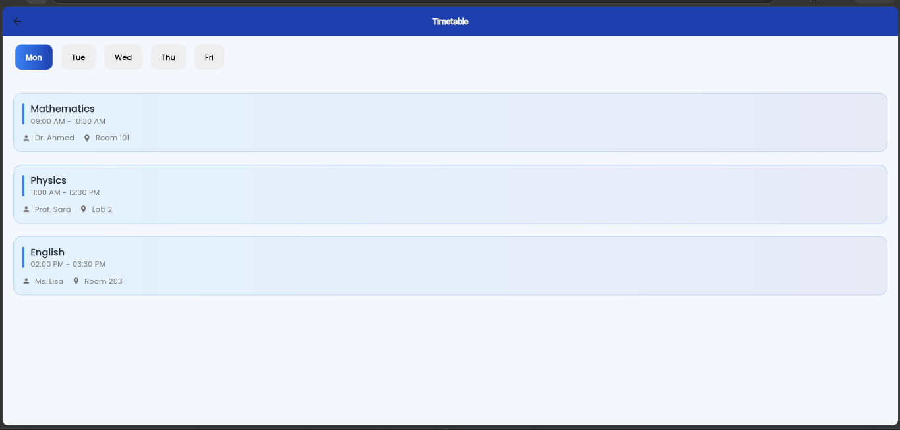
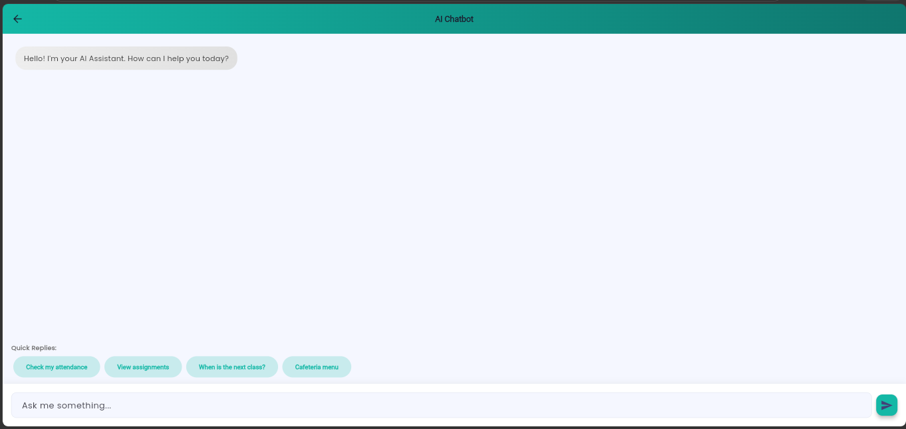
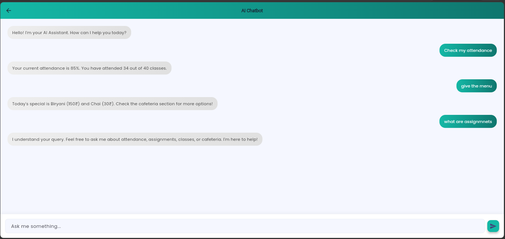

# Smart University App 🎓

The Smart University App is a full-stack mobile application developed using Flutter, Node.js, and MySQL to digitally manage university-related services. It provides a centralized digital platform for university students. 

## ✨ Features

* **📊 Attendance Tracking:** Allows students to view attendance records and track percentages.
* **📅 Timetable Management:** Displays the class timetable and upcoming schedules.
* **✏️ Assignment Dashboard:** Shows assignments along with their due dates and current status.
* **🎉 Campus Events:** Provides updates on university events and important announcements.
* **🍽️ Cafeteria Menu & Ordering:** Includes a cafeteria module for viewing menu items and placing orders.
* **🤖 AI Chatbot:** Features an AI chatbot designed to answer software-development-related questions.
* **📚 Learning Resources:** Supports images, GIFs, and downloadable PDF or Word learning resources.

## 🛠️ Technology Stack

* **Frontend:** Developed using Flutter.
* **Backend:** Developed using Node.js.
* **Database:** Developed using MySQL.
* **API:** Uses REST APIs to connect the Flutter app with the backend and database.

---

## 📸 App Screenshots

Below is a visual overview of the application and the backend environment:

### Backend & Database Environment
* **Mysql database Xampp:**
  
* **Node js server running:**
  

### Flutter Application Interfaces
* **Welcome screen:**
  
* **Complete dashboard:**
  
* **Announcements:**
  
* **Assignments:**
  
* **Attendance:**
  
* **Cafetaria:**
  
* **Events:**
  
* **Timetable:**
  
* **AI Chat-bot:**
  
  

---

## 🚀 Getting Started

Follow these steps to run the application on your local machine.

### 1. Database Setup
1. Start **Apache** and **MySQL** from your XAMPP Control Panel.
2. Open phpMyAdmin (`http://localhost/phpmyadmin`).
3. Import the `backend/setup.sql` file to create the database and populate it with sample data.

### 2. Backend Setup
Open a terminal and navigate to the backend directory to start the server:
```bash
cd backend
npm install
npm run dev
(The API will be running on http://localhost:3000)

3. Frontend Setup
Open a new terminal and run the Flutter app:

Bash
cd frontend
flutter pub get
flutter run -d chrome
👨‍💻 Author
Ahmed Hassan (@Ahmed-hs-2005)
